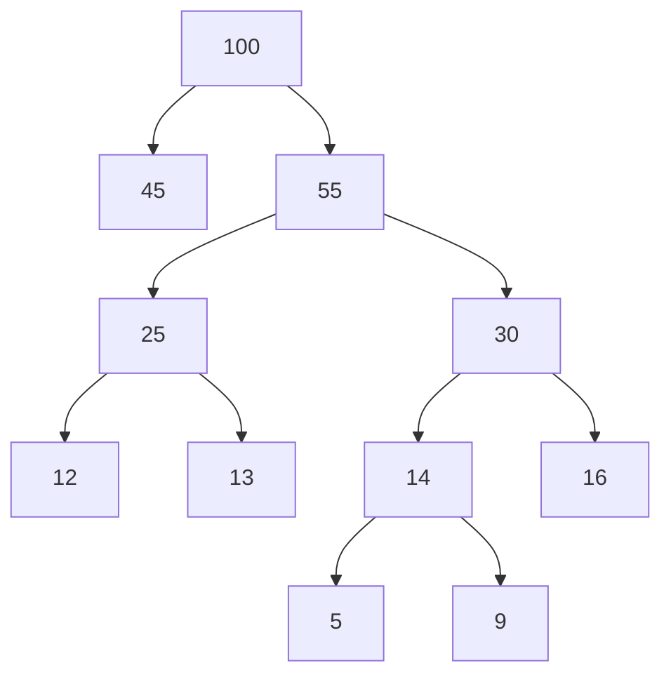
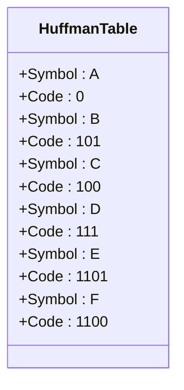

# 最常见的图像压缩算法：JPEG


# DIP-JPEG 图像压缩

## 为什么 JPEFG 有用

人类眼镜的细胞对图像的感知程度，亮度比色度感知强烈的多。

因此减少人类眼镜感知较弱的区域，即减少颜色的差异，就可以实现压缩。

## 压缩步骤

1. 首先需要进行色彩空间转换，每一个像素都有 RGB 的红绿蓝叠加，算法需要通过一个固定的公式算出**Y（亮度）、Cb（蓝色色度）、Cr（红色色度）**。

2. 进行色度缩减取样，很多数据会被删除。将蓝色和红色色度分量层的像素按照 2x2 像素成一个区块这样划分。然后计算每个区块的平均值，然后缩小图像（4:2:0），使得含有 1 个平均值的由 4 个像素组成的区块只占一个像素的空间。于是那些我们 👀 眼睛不易感知的红蓝色度信息量 shrink to 1/4 size，而亮度（luminance）保持不变。_（网上流行的包浆图就是这么来的）_

   > 考虑一下刚才的两步，计算之前 SIZE=1+1+1=3.0，计算之后为 SIZE=1+1/4+1/4=1.5，图像已经变为原来大小的一半了。

3. 当我们查看图像时，会放大图像到原始尺寸，根据 YCbCr 重新计算 RGB*（可能发生变化）*

4. 接下来的两个步骤是**重点**，进行**离散余弦变换（Discrete Cosine Transform,DCT ）**和**量化（Quantiaztion）**。这利用了人眼不擅长感知高频率的图像信息的原理，即对于细节并不能精确感知。如阴影变化，和摄影中失焦的场景。以上两个步骤会遍历图像各个部分，并找到由高频率色度或亮度的像素频繁出现的区域，然后将这些人眼很难感知的像素删除。对于三个图层中的每一个图层进行以下步骤*（以亮度涂层举例）*： - 将整个图像**按照 8x8 像素划分成许多区域**，称为“区块”。每个区块因此有 64 像素，每个像素用 0 ～ 255 的数值表示。如果是亮度图层就是代表亮度值。 - 减去 128 来改变各个亮度数值，这样取值范围就变成了-128 ～-127。（亮度图-128 为黑色，127 为白色） - 每一个区块内，我们可以先找到 64 个 8x8 基本图像（正弦函数的频率域图）并且每个图像都会有一个计算得出的 DCT 系数，原始图像可以通过计算出的每个基本图像 ✖️ 它对应的系数后再叠加 64 次得出。_（具体的数学公式笔者也不了解，请自行网上查阅）_

   > DCT 不能压缩或缩小图像，但下一个步骤，量化可以

5. DCT 后我们会有一个常数表，我们要把其中的各个值除上对应量化表中的各个值，并四舍五入取整。

   

​ 量化表右下角数值偏高，是人眼不擅长感知德高频数据。而数值 较小的左上角是人眼更容易区分的样式所在。

​ 在刚才的步骤中，我们舍弃了人眼无法感知的数据，针对色度， 我们会采用一个数值更大的量化表，舍去更多的颜色数据。

## 小结

- 从本质上讲，整个余弦变换+量化的过程，**一整张图像都使用了一组相同的 64 个基础图像和两个量化表：一个用于亮度，另一个用于色度。以便将 8x8 的像素区块转换为几个数字和一大堆的 0。**

## 编码

### 游程编码

- 在这一步骤中，我们列出所有区块中的亮度与色度数值（更改后）。然而是这样的顺序：

  

- 因为这样子更可能找到一连串的非 0 数字。

- 接下来，在我们列出的数字中，使用游程编码 Run length encoding algorithm，列出我们有几个 0。这样只有几十个数字的列表显然比 0 ～ 255 的方法压缩的多。


### 哈夫曼编码 Huffman Encoding

​ 这种独立编码也运用在 H.264 视频压缩算法中（也被称为高级视频编码，AVC），是目前 Youtube 上传视频推荐的视频压缩算法。它使用了色度所见取样或色度抽样技术，以及离散余弦变换和量化技术的一些变种。

​ 这里对哈夫曼编码进行简述，感兴趣的可以查阅资料自行了解。

1.  需要对待编码的数据中每个符号出现的频率进行统计。这些频率将用于构建哈夫曼树。

2.  哈夫曼树是一种二叉树，其中每个叶子节点代表一个符号，且路径长度与符号的频率相关。构建哈夫曼树的步骤如下：

    ​ 1. **初始化**：将所有符号视为独立的节点，并按照频率从小到大排序。

    ​ 2. **合并最小频率的两个节点**：将频率最小的两个节点合并为一个新的父节点，其频率为两个子节点频率之和。

    ​ 3. **重复合并**：将新节点加入节点列表中，重新排序，重复步骤 2，直到所有节点合并成一棵树。

3.  根据哈夫曼树**生成哈夫曼表**，从根节点到每个叶子节点的路径决定了该符号的哈夫曼编码。通常，向左分支记为 0，向右分支记为 1。





#### H.264

​ 然而，H.264 显然更加复杂，因为它不是像 JPEG 那样压缩单一的静态图像。每 30 帧使用 iFrame（JPEG），而其他 29 帧使用预测或双向预测,只对差异和运动进行编码，同时使用先前解码的帧作为参考。

#### 重构图片过程

- 让我们回到 JPEG，首先我们执行哈夫曼解码,根据哈夫曼表将编码变回 DCT 系数，例如：

  ```plaintext
  Compressed Data: 110100010...
  Decoded DCT Coefficients: [16, 11, -10, ...]
  ```

- 并且分解游程编码（disassemble），然后把一连串的数字按照**去交错**（De-Zigzag）的方式重新排列为 8x8 矩阵。

- 接下来，我们执行**反量化**，通俗来讲就是讲各个值乘以量化表（之前讲过的那两张表，之前是除法），然后将所得常数乘以相应的基础图像（基础图像也是一开始就有的，之前也是除法），并将所有结果图像叠加在一起。

- 将蓝色跟红色色度图像放大，并将亮度和色度值重新转换为 RGB 色彩空间。

> 智能手机相机的拍摄照片至少有十几万像素，JPEG 在几秒钟内就要完成压缩和解压缩，真是不可思议！

## JPEG 的缺点

有时候，你可以选择压缩的程度，而这会改变量化表的数值，这种四舍五入做除法的算法，如果压缩量变大，那么就会有更多的 0，图像也会因此变得更小。

然而，如果压缩量过大，图像会出现 artifacts，或者说块效应。它们看起开就像方块边缘的模糊斑点（类似于基础图像，就是离散余弦变换表中的特征，图像有很明显的横线或竖线）。

其次，压缩会去除高频数据，使得图像的精确度降低。

然而，这也是一种优点，因为没有一个相机能够做到完美对焦，所以很难分辨出未压缩和压缩的图像之间的区别。

但是，压缩矢量图的表现不佳，直线的压缩会出现锯齿。因为 JPEG 依靠基础图像来重建直线。

## 总结

JPEG 仍是使用量最多的图片压缩算法，因为它古老、为人熟知、无版权。

但还有很多其他图像格式，也具有很好的压缩能力。

